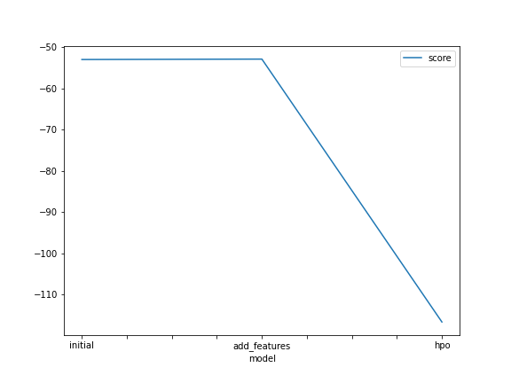

# Report: Predict Bike Sharing Demand with AutoGluon Solution
#### Pedro Azevedo

## Initial Training
### What did you realize when you tried to submit your predictions? What changes were needed to the output of the predictor to submit your results?
We needed to filter out predictions that were smaller than zero

### What was the top ranked model that performed?
The model with default parameters, with a WeightedEnsemble_L3 being the top performer

## Exploratory data analysis and feature creation
### What did the exploratory analysis find and how did you add additional features?
That there semnt to be a correlation between the variables and perhaps it was better to add aditional features.
I extracted the day / month / year as a features and it seems that the day was an important extractor.
### How much better did your model preform after adding additional features and why do you think that is?
Surprisingly it did not do any better. Perhaps its a simple dataset and the model regularizes itself in order to not need useless features.
So it keeps the weights of the features with most signals.

## Hyper parameter tuning
### How much better did your model preform after trying different hyper parameters?
It did not do any better, I should have narrowed down the hyperparameter search space to the hyperparameters of the better performing models of the ensemble.

### If you were given more time with this dataset, where do you think you would spend more time?
Feature engineering and hyperparameter tunning.

### Create a table with the models you ran, the hyperparameters modified, and the kaggle score.
|model|hpo1|hpo2|hpo3|score|
|--|--|--|--|--|
|initial|default_vals|default_vals|default_vals|1.79654|
|add_features|default_vals|default_vals|default_vals|1.79654|
|hpo|'CAT': {'iterations': 10000}"|'RF': {'n_estimators': 300}|'XT': {'n_estimators': 300}|1.41905|

### Create a line plot showing the top model score for the three (or more) training runs during the project.

### Create a line plot showing the top kaggle score for the three (or more) prediction submissions during the project.

## Summary
The ensemble of model seems to do a good job in predicting the total number of bikes.
